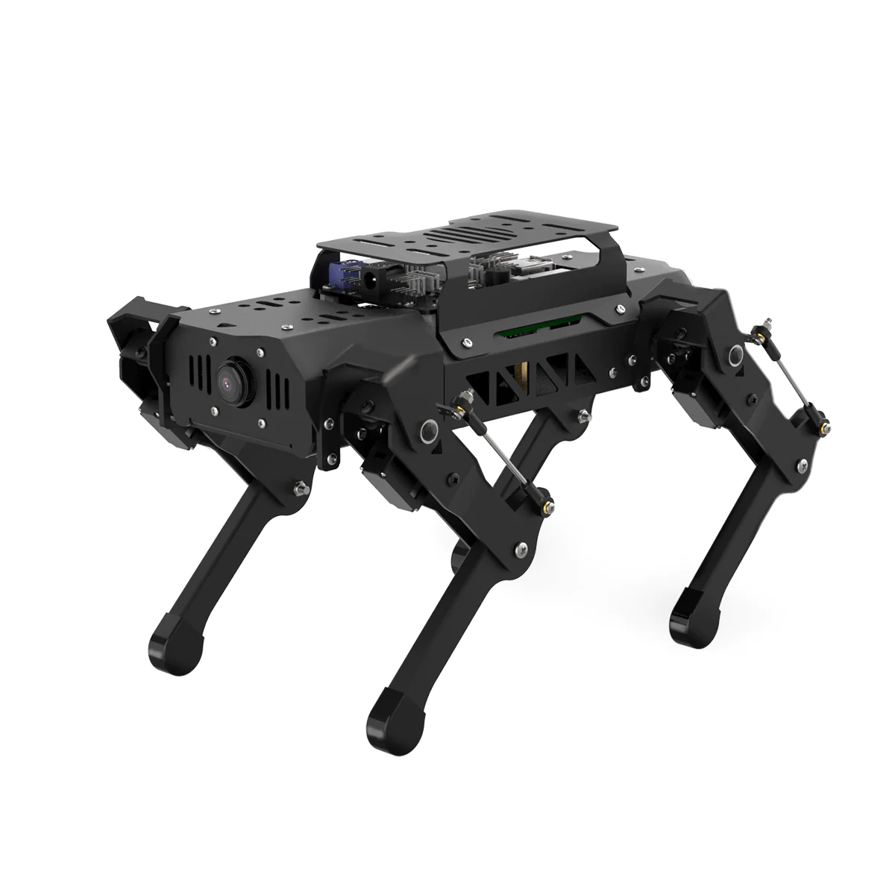

# PuppyPi Robot

PuppyPi is a quadrepedal robot dog designed for research purposes. It can be controlled remotely using a dedicated remote control or autonomously through computer vision capabilities. The project focuses on data acquisition from various surfaces and terrains to optimize the navigation of quadrapedal robots.

## Table of Contents

- [Features](#features)
- [Getting Started](#getting-started)
- [Usage](#usage)
- [License](#license)

## Features

- **Remote Control:** Can be controlled remotely using a dedicated remote control.
- **Autonomous Operation:** Utilizes computer vision for autonomous navigation.
- **Research Focus:** Developed for data acquisition on different surfaces and terrains.
- **Python and Raspberry Pi:** Created using Python programming language and Raspberry Pi hardware.

## Getting Started

## Usage

For a comprehensive guide on using and configuring PuppyPi, Hiwonder offers an excellent resource. You can explore step-by-step tutorials and valuable information at the [PuppyPi YouTube Playlist](https://www.youtube.com/playlist?list=PLFbzd0m6AcmLo13vgTbBB5OHAJsb1smPH). Whether you're a beginner or an enthusiast, this resource provides insights into effectively utilizing and setting up your PuppyPi.

## License

This project is licensed under the terms of the [GNU General Public License (GPL) version 3.0](LICENSE).

You can find a copy of the license in the [LICENSE](LICENSE) file included with this distribution.
